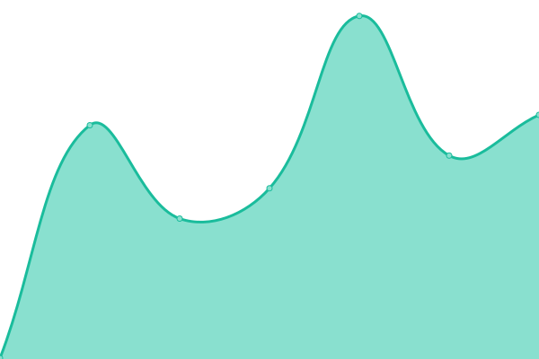
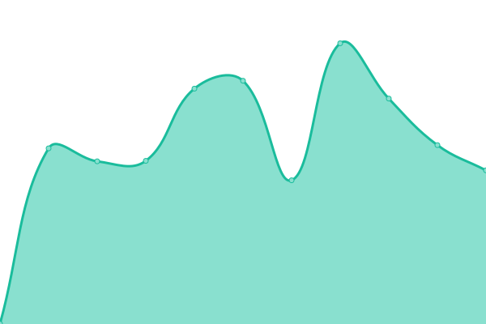
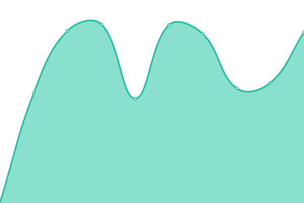
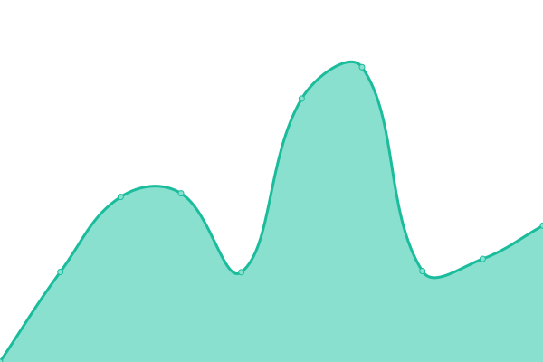
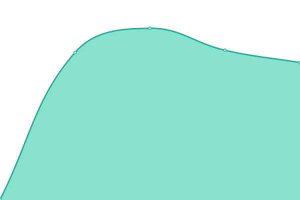
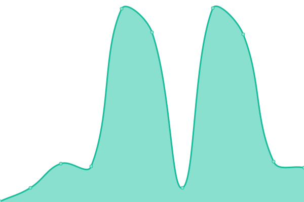
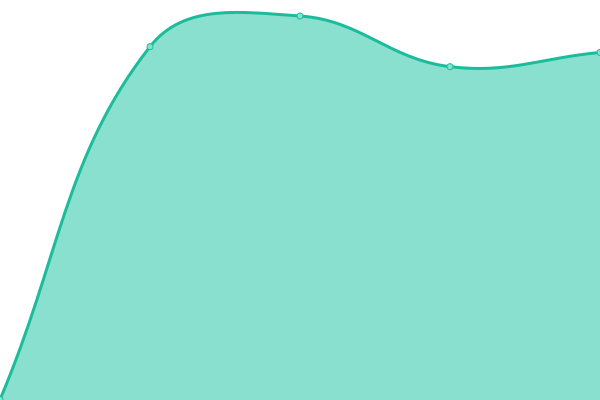

# [📈 Live Status](https://UAL-ODIS.github.io/uptime): <!--live status--> **🟩 All systems operational**

This repository contains the open-source uptime monitor and status page for [Office of Digital Innovation and Stewardship (University of Arizona Libraries)](https://new.library.arizona.edu/departments/odis), powered by [Upptime](https://github.com/upptime/upptime).

With [Upptime](https://upptime.js.org), you can get your own unlimited and free uptime monitor and status page, powered entirely by a GitHub repository. We use [Issues](https://github.com/UAL-ODIS/uptime/issues) as incident reports, [Actions](https://github.com/UAL-ODIS/uptime/actions) as uptime monitors, and [Pages](https://UAL-ODIS.github.io/uptime) for the status page.

<!--start: status pages-->
<!-- This summary is generated by Upptime (https://github.com/upptime/upptime) -->
<!-- Do not edit this manually, your changes will be overwritten -->

| URL                                                               | Status | History                                                                                                                          | Response Time                                                                                      | Uptime                                                                                                                                                                                                                                                     |
| ----------------------------------------------------------------- | ------ | -------------------------------------------------------------------------------------------------------------------------------- | -------------------------------------------------------------------------------------------------- | ---------------------------------------------------------------------------------------------------------------------------------------------------------------------------------------------------------------------------------------------------------- |
| [Research Data Management Site](https://data.library.arizona.edu) | 🟩 Up  | [research-data-management-site.yml](https://github.com/UAL-ODIS/uptime/commits/master/history/research-data-management-site.yml) |  301ms |  |
| [ReDATA](https://arizona.figshare.com)                            | 🟩 Up  | [re-data.yml](https://github.com/UAL-ODIS/uptime/commits/master/history/re-data.yml)                                             |  825ms                       |                                              |
| ReDATA (stage)                                                    | 🟩 Up  | [re-data-stage.yml](https://github.com/UAL-ODIS/uptime/commits/master/history/re-data-stage.yml)                                 |  741ms                 |                                  |
| [Campus Repository](https://repository.arizona.edu/)              | 🟩 Up  | [campus-repository.yml](https://github.com/UAL-ODIS/uptime/commits/master/history/campus-repository.yml)                         |  1022ms            |                           |
| [Spatial Data Explorer](https://geo.library.arizona.edu/)         | 🟩 Up  | [spatial-data-explorer.yml](https://github.com/UAL-ODIS/uptime/commits/master/history/spatial-data-explorer.yml)                 |  530ms         |                  |
| [Afghan Respository](http://www.afghandata.org/)                  | 🟩 Up  | [afghan-respository.yml](https://github.com/UAL-ODIS/uptime/commits/master/history/afghan-respository.yml)                       |  111ms            |                        |
| [UAL Janeway](https://journals.librarypublishing.arizona.edu/)    | 🟩 Up  | [ual-janeway.yml](https://github.com/UAL-ODIS/uptime/commits/master/history/ual-janeway.yml)                                     |  798ms                   |                                      |

<!--end: status pages-->

[**Visit our status website →**](https://UAL-ODIS.github.io/uptime)

## 📄 License

- Code: [MIT](./LICENSE) © [Office of Digital Innovation and Stewardship (University of Arizona Libraries)](https://new.library.arizona.edu/departments/odis)
- Data in the `./history` directory: [Open Database License](https://opendatacommons.org/licenses/odbl/1-0/)
