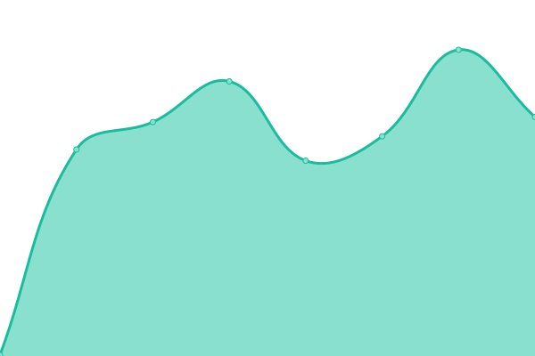
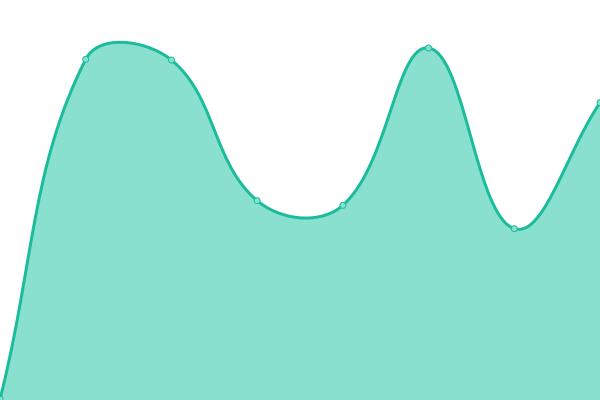
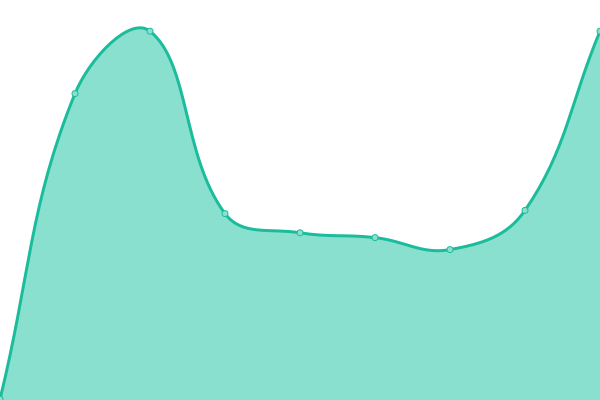

# [📈 Live Status](https://UAL-ODIS.github.io/uptime): <!--live status--> **🟩 All systems operational**

This repository contains the open-source uptime monitor and status page for [Office of Digital Innovation and Stewardship (University of Arizona Libraries)](https://new.library.arizona.edu/departments/odis), powered by [Upptime](https://github.com/upptime/upptime).

With [Upptime](https://upptime.js.org), you can get your own unlimited and free uptime monitor and status page, powered entirely by a GitHub repository. We use [Issues](https://github.com/UAL-ODIS/uptime/issues) as incident reports, [Actions](https://github.com/UAL-ODIS/uptime/actions) as uptime monitors, and [Pages](https://UAL-ODIS.github.io/uptime) for the status page.

<!--start: status pages-->
<!-- This summary is generated by Upptime (https://github.com/upptime/upptime) -->
<!-- Do not edit this manually, your changes will be overwritten -->
<!-- prettier-ignore -->
| URL | Status | History | Response Time | Uptime |
| --- | ------ | ------- | ------------- | ------ |
|  [Research Data Management Site](https://data.library.arizona.edu) | 🟩 Up | [research-data-management-site.yml](https://github.com/UAL-ODIS/uptime/commits/HEAD/history/research-data-management-site.yml) | 

 254ms
     
 | 

<a href="https://UAL-ODIS.github.io/uptime/history/research-data-management-site">100.00%</a>
    

|  [ReDATA](https://arizona.figshare.com) | 🟩 Up | [re-data.yml](https://github.com/UAL-ODIS/uptime/commits/HEAD/history/re-data.yml) | 

 721ms
     
 | 

<a href="https://UAL-ODIS.github.io/uptime/history/re-data">100.00%</a>
    

|  ReDATA (stage) | 🟩 Up | [re-data-stage.yml](https://github.com/UAL-ODIS/uptime/commits/HEAD/history/re-data-stage.yml) | 

 734ms
     
 | 

<a href="https://UAL-ODIS.github.io/uptime/history/re-data-stage">100.00%</a>
    

|  [Campus Repository](https://repository.arizona.edu/) | 🟩 Up | [campus-repository.yml](https://github.com/UAL-ODIS/uptime/commits/HEAD/history/campus-repository.yml) | 

 1051ms
     
 | 

<a href="https://UAL-ODIS.github.io/uptime/history/campus-repository">98.36%</a>
    

|  [Spatial Data Explorer](https://geo.library.arizona.edu/) | 🟩 Up | [spatial-data-explorer.yml](https://github.com/UAL-ODIS/uptime/commits/HEAD/history/spatial-data-explorer.yml) | 

 485ms
     
 | 

<a href="https://UAL-ODIS.github.io/uptime/history/spatial-data-explorer">100.00%</a>
    

|  [Afghan Respository](http://www.afghandata.org/) | 🟩 Up | [afghan-respository.yml](https://github.com/UAL-ODIS/uptime/commits/HEAD/history/afghan-respository.yml) | 

 175ms
     
 | 

<a href="https://UAL-ODIS.github.io/uptime/history/afghan-respository">100.00%</a>
    

|  [UAL Janeway](https://journals.librarypublishing.arizona.edu/) | 🟩 Up | [ual-janeway.yml](https://github.com/UAL-ODIS/uptime/commits/HEAD/history/ual-janeway.yml) | 

 1537ms
     
 | 

<a href="https://UAL-ODIS.github.io/uptime/history/ual-janeway">100.00%</a>
    

|  [UA Institutional Repository](https://uair.library.arizona.edu/) | 🟩 Up | [ua-institutional-repository.yml](https://github.com/UAL-ODIS/uptime/commits/HEAD/history/ua-institutional-repository.yml) | 

 437ms
     
 | 

<a href="https://UAL-ODIS.github.io/uptime/history/ua-institutional-repository">100.00%</a>
    

<!--end: status pages-->

[**Visit our status website →**](https://UAL-ODIS.github.io/uptime)

## 📄 License

- Code: [MIT](./LICENSE) © [Office of Digital Innovation and Stewardship (University of Arizona Libraries)](https://new.library.arizona.edu/departments/odis)
- Data in the `./history` directory: [Open Database License](https://opendatacommons.org/licenses/odbl/1-0/)
