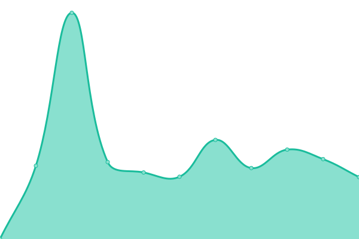
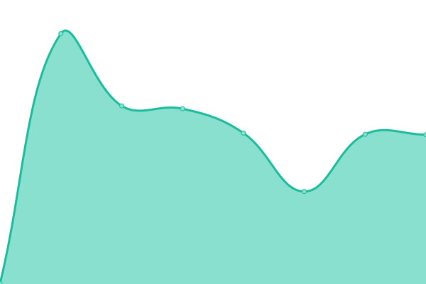

# [📈 Live Status](https://UAL-RE.github.io/uptime): <!--live status--> **🟩 All systems operational**

This repository contains the open-source uptime monitor and status page for [Research Engagement (University of Arizona Libraries)](https://new.library.arizona.edu/departments/odis), powered by [Upptime](https://github.com/upptime/upptime).

With [Upptime](https://upptime.js.org), you can get your own unlimited and free uptime monitor and status page, powered entirely by a GitHub repository. We use [Issues](https://github.com/UAL-RE/uptime/issues) as incident reports, [Actions](https://github.com/UAL-RE/uptime/actions) as uptime monitors, and [Pages](https://UAL-RE.github.io/uptime) for the status page.

<!--start: status pages-->
<!-- This summary is generated by Upptime (https://github.com/upptime/upptime) -->
<!-- Do not edit this manually, your changes will be overwritten -->
<!-- prettier-ignore -->
| URL | Status | History | Response Time | Uptime |
| --- | ------ | ------- | ------------- | ------ |
|  [Data Cooperative Site](https://data.library.arizona.edu) | 🟩 Up | [data-cooperative-site.yml](https://github.com/UAL-RE/uptime/commits/HEAD/history/data-cooperative-site.yml) | 

 191ms
     
 | 

<a href="https://UAL-RE.github.io/uptime/history/data-cooperative-site">100.00%</a>
    

|  [ReDATA](https://arizona.figshare.com) | 🟩 Up | [re-data.yml](https://github.com/UAL-RE/uptime/commits/HEAD/history/re-data.yml) | 

 850ms
     
 | 

<a href="https://UAL-RE.github.io/uptime/history/re-data">100.00%</a>
    

|  ReDATA (stage) | 🟩 Up | [re-data-stage.yml](https://github.com/UAL-RE/uptime/commits/HEAD/history/re-data-stage.yml) | 

 523ms
     
 | 

<a href="https://UAL-RE.github.io/uptime/history/re-data-stage">100.00%</a>
    

|  [Campus Repository](https://repository.arizona.edu/) | 🟩 Up | [campus-repository.yml](https://github.com/UAL-RE/uptime/commits/HEAD/history/campus-repository.yml) | 

 1075ms
     
 | 

<a href="https://UAL-RE.github.io/uptime/history/campus-repository">100.00%</a>
    

|  [UAL Janeway](https://journals.librarypublishing.arizona.edu/) | 🟩 Up | [ual-janeway.yml](https://github.com/UAL-RE/uptime/commits/HEAD/history/ual-janeway.yml) | 

 1152ms
     
 | 

<a href="https://UAL-RE.github.io/uptime/history/ual-janeway">99.93%</a>
    

|  [UA Institutional Repository](https://uair.library.arizona.edu/) | 🟩 Up | [ua-institutional-repository.yml](https://github.com/UAL-RE/uptime/commits/HEAD/history/ua-institutional-repository.yml) | 

 344ms
     
 | 

<a href="https://UAL-RE.github.io/uptime/history/ua-institutional-repository">100.00%</a>
    

|  [UA ORCID](https://orcid.arizona.edu) | 🟩 Up | [ua-orcid.yml](https://github.com/UAL-RE/uptime/commits/HEAD/history/ua-orcid.yml) | 

 252ms
     
 | 

<a href="https://UAL-RE.github.io/uptime/history/ua-orcid">100.00%</a>
    

<!--end: status pages-->

[**Visit our status website →**](https://UAL-RE.github.io/uptime)

## 📄 License

- Code: [MIT](./LICENSE) © [Research Engagement (University of Arizona Libraries)](https://new.library.arizona.edu/departments/odis)
- Data in the `./history` directory: [Open Database License](https://opendatacommons.org/licenses/odbl/1-0/)
